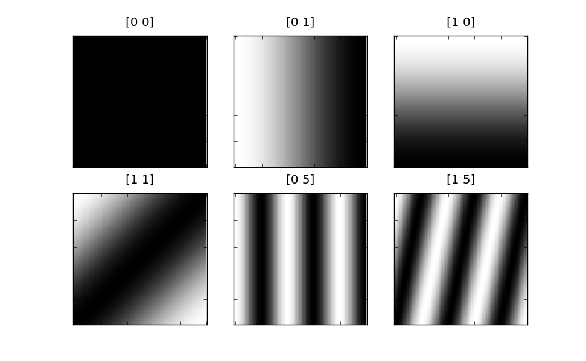
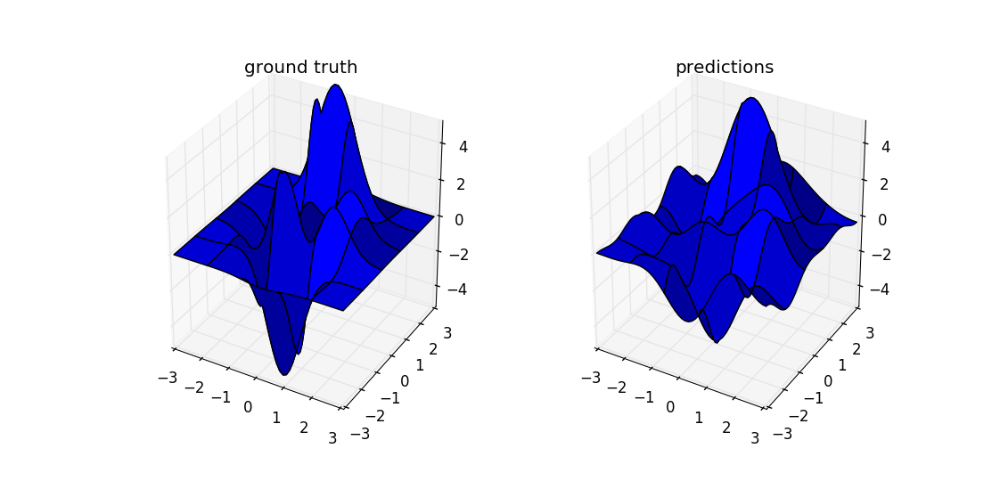
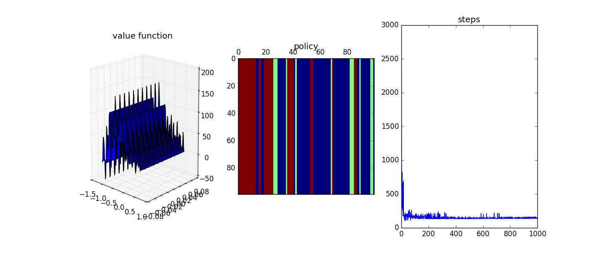

# fourier
Sarsa(Lambda) Reinforcement Learner with Fourier features for gym environments.

## Usage
See run_sarsa_mc.py or run_sarsa_pb.py for example usage.

## Results
Example basis functions over 2D state space:

Function approximation example:

Results on MountainCar:

